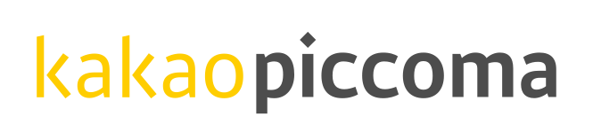
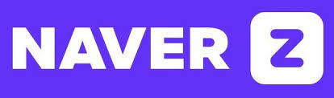
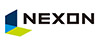
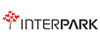
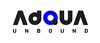
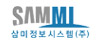

# Career

Kakao Piccoma _**| 2022.11.01 - Current**_

> 데이터툴 개발팀

### Featured Work

* Observer 개발 (사내 데이터 기반 업무 효율 시스템)
  * 기술 스택
    * react 18, react-query, fastAPI
  * 내용
    * 일본 픽코마 데이터 기반 업무 효율 및 데이터 분석 시스템
  * 성과
    * 런칭 직 후, 사내 필수 시스템으로 전사 관리.
    * 기존 엑셀 기반 업무를 시스템으로 대체
    * AI 기반 챗봇으로 업무 효율화
* Tsuchan 개발
  * 기술 스택
    * fastAPI, AWS Bedrock, Clade 3.5
  * 내용
    * 사내 LLM기반 챗봇 시스템
  * 성과
    * Observer 연동
    * Observer 서비스 및 데이터 기반으로 사내 sLM 시스템 구현
    * 자연어 기반의 Observer 인터페이스 연동
* 구매동선 개선 작업
  * 기술 스택
    * Nextjs 13, react-query, tailwind css, AWS Lambda
  * 내용
    * 프랑스 현지 결제 모듈 axepta 연동 완료
    * 글로벌 결제 모듈 paypal 연동 완료
    * AWS Lambda를 활용하여 작품 이미지 해싱처리 (https://blurha.sh/) 기능 완료
    * tailwindcss 사용하여 테블릿 및 landscape 모드 대응 완료
  * 성과
    * PU(결제 유저)/PRU(결제 후 재화 소비 유저) 10% 증가
* 픽코마 재팬 프론트엔드 개선
  * 기술 스택
    * Nextjs 14, pnpm, Docker, AWS CodeDeploy
  * 내용
    * 픽코마 재팬 프론트엔드 개선 프로젝트 리더
    * pnpm(https://pnpm.io/ko/) 기반으로 공통 Repository 관리 도입 완료 배포
    * 프로세스 개선을 위해 Teamcity + AWS CodeDeploy 도입 완료
    * Python Django 기반 서비스를 Nextjs 14를 사용하여 마이그레이션 작업 완료
* "기다리면 무료" 리브랜딩 작업
  * 기술 스택
    * Nextjs 13, Docker
  * 내용
    * framer-motion(https://www.framer.com/motion/)을 사용하여 서비스 애니메이션 공통 모듈로 작업 완료
    * atom design pattern 도입하여 component 관리 rule 확립

## _**Naver Z | 2022.04.18 - 2022.09.20**_

> Internal Service

### Featured Work

* 네이버 Z MLOps 시스템 개발 및 런칭
* 네이버 클라우드 협업 수익화 논의 진행

## _**Nexon | 2019.01.07 - 2022.04.15**_

> 인텔리전스랩스 머신러닝파트 | 파트장

### Featured Work

* 넥슨 FGT Fullstack 웹 개발 및 인프라 구축
* 넥슨 카트라이더:Drift TMI 전적조회 서비스 반응형 웹 Fullstack 개발
* 넥슨 머신러닝 서든어택 월핵탐지 서비스 Fullstack 개발
* 넥슨 머신러닝 모델 학습 자동화 서비스 Fullstack 웹 보드 개발 및 인프라 구축
* 넥슨 머신러닝 이력서 서류통과 예측 서비스 Fullstack 개발
* 넥슨 카트라이더 TMI 전적조회 서비스 웹 Fullstack 개발
* 넥슨 카트라이더 TMI 전적조회 서비스 모바일 Fullstack 개발
* 넥슨 카트라이더 TMI 전적조회 서비스 어드민 Fullstack 개발

### Result

* Vuejs, React 프로젝트 전문성 함양
* Docker, Kubernetes 인프라 기술 적극 활용
* AWS 클라우드 인프라 활용
* 머신러닝 인프라 도입
* 카트라이더 전적 조회 DAU 1만, 네이버 블로그, 유튜브 컨텐츠 유도
* 성과평가 우수

## _Interpark | 2017.05.16 - 2018.12.14_

> Front 개발팀 | 대리

### Work

* 인터파크 투어 모바일 리뉴얼 FrontEnd 개발 리딩
* 인터파크 투어 통합검색 PC 서비스 FrontEnd 개발
* 인터파크 투어 통합검색 모바일 서비스 FrontEnd 개발
* 인터파크 투어 챗봇 톡집사 서비스 FrontEnd 개발
* 인터파크 투어 6회 온라인 박람회 사이트 FrontEnd 개발

### Result

* Vuejs, React 프로젝트 다수 수행
* 사내 Javascript 강사 (강의자료 | [https://github.com/batteryhob/javascript-lecture-pdf.git](https://github.com/batteryhob/javascript-lecture-pdf.git) )
* 프로젝트 리딩 경험
* 다수의 리뉴얼 서비스 안정화
* 성과평가 우수

## _**Adqua Interactive | 2015.01.26 - 2017.04.18**_

> Tech 본부 | 주임

### Featured Work

* 시몬스 브랜드 쇼핑몰 리뉴얼 웹 개발
* 세노비스 브랜드 쇼핑몰 웹 개발
* 다수의 프로모션 페이지 웹 개발

### Result

* 인스타그램, 페이스북, 카카오, 네이버 외부 API 관련 웹 개발
* Angular 프로젝트 수행
* PG 결제 관련 웹 개발
* Socket 관련 웹 개발
* 시몬스 브랜드 사이트 매출 증가
* 2015년 웹어워드 코리아 최우수상 수상

## _Sammi Information System | 2013.11.01 - 2015.01.08_

> 시스템사업부 | 사원

### Work

* MES 관련 웹 개발
* Socket 관련 웹 개발

### Result

* 후속 프로젝트 수주
