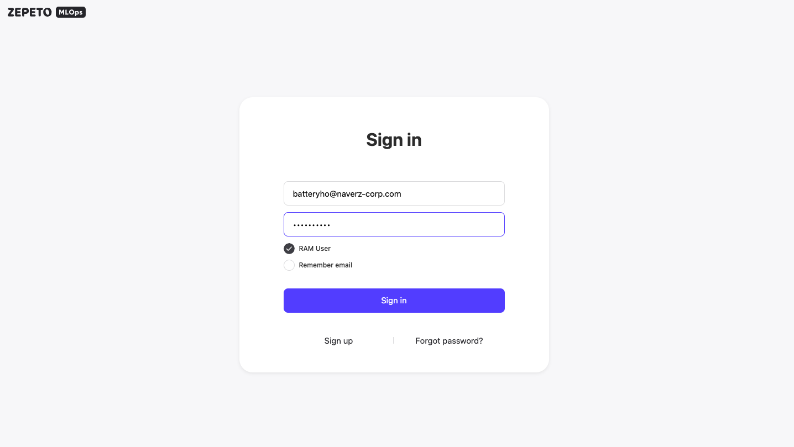
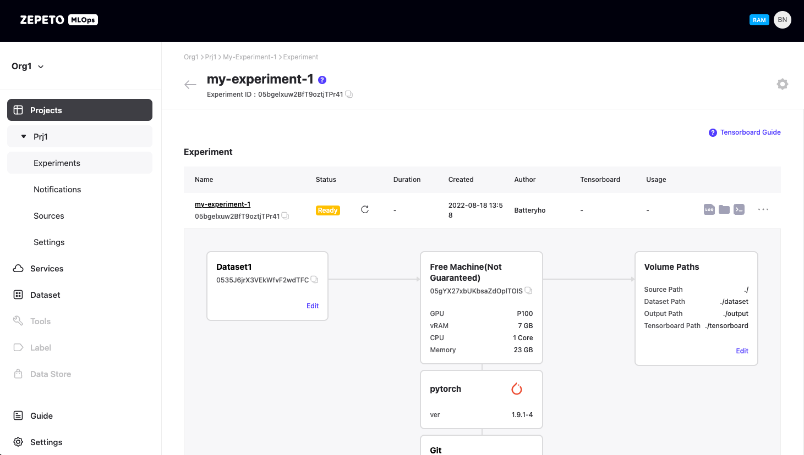
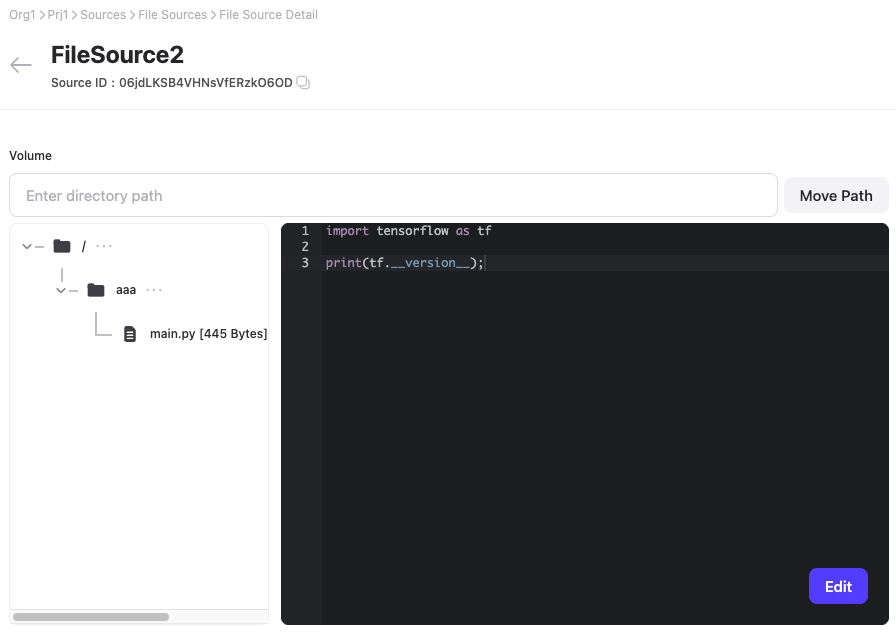
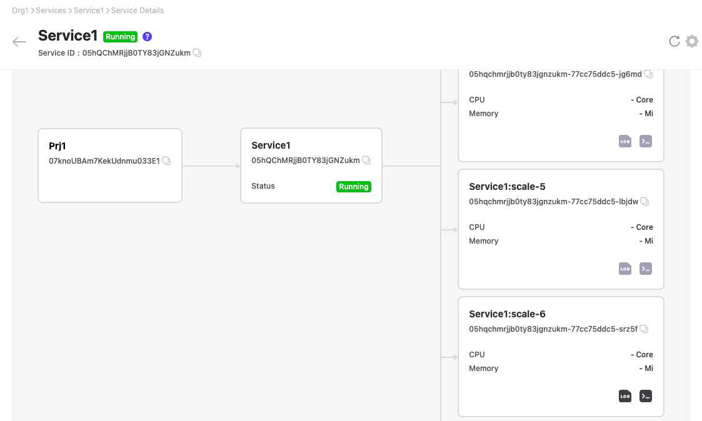

# Naver Z MLOps Service


react, redux/toolkit, redux/tookit-query, typescript가 사용되었습니다.


## Result

웹 IDE, VNC Console등 다양한 웹 콘솔 기능을 제공하는 웹 어플리케이션을 구현해 성공적으로 오픈했습니다. 추후 수익화 논의가 진행되는 성과가 있었습니다.

<figure><figcaption>
Web Login
</figcaption></figure>

<figure><figcaption>
ML Experiment
</figcaption></figure>

<figure><figcaption>
Web IDE
</figcaption></figure>

<figure><figcaption>
Web VNC Console
</figcaption></figure>

<figure><figcaption>
Customize Services
</figcaption></figure>
