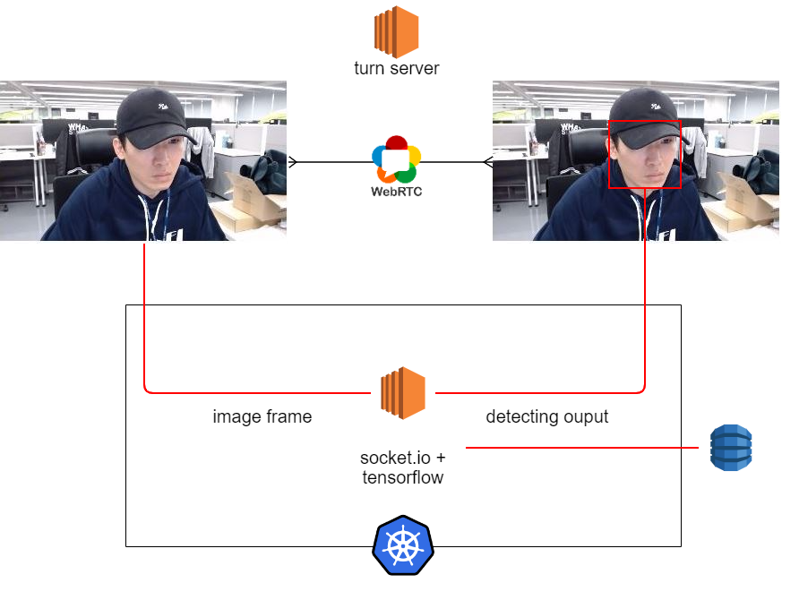

# Nexon Focus Group Test


해당 프로젝트는 SCI저널에 논문으로 등재했습니다. 논문 저자로 이름을 올렸습니다.



IEEE Explore



해당 프로젝트는 특허(참조번호: PN136538)로 출원되었으며 발명자로 등록되었습니다.



_webrtc(실시간 영상처리) vuejs socket.io flask tensorflow(머신러닝) kubenetes가 사용되었습니다._


.gif>)

## How did you resolve major issue?

#### 실시간 영상의 머신러닝 처리를 프레임 드랍이 적게 할 수 있을까?

영상과 프레임 인퍼런스를 서로 다른 프로세스로 진행하고 결과를 합쳐서 보여주도록 했습니다. webrtc로 연결된 스트림위에 소켓통신으로 프레임 단위로 진행된 인퍼런스 결과를 css로 보여주었습니다.

