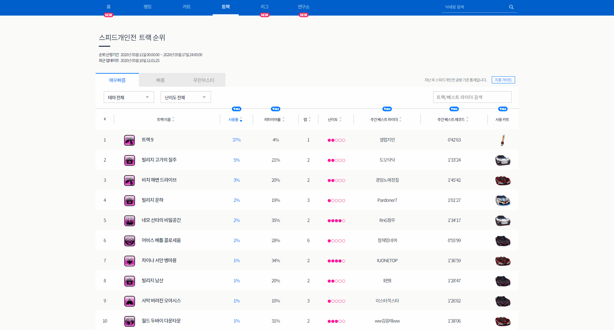

# D3 | Github



## Overview

게임로그를 데이터분석가에게 의뢰해 Nosql 데이터베이스에 ETL을 요청한 뒤,

해당 데이터를 그래프로 뿌리기 쉽게 가공해 D3로 Visualizing 했습니다.

위 기능은 사용자로 하여금 큰 호응을 받았습니다.



## Sample Code | Vue

깃헙에서 샘플코드를 다운받아  확인하실 수 있습니다.



```
$ git clone https://github.com/batteryhob/kartrider-trackbuild-d3-vue-app.git
```


본 소스는 기업의 허락을 받아 공유 및 재사용을 위해 리팩토링한 샘플 소스로 기업의 보안을 해하거나 중요한 정보가 포함되지 않음을 명시합니다.


다음 명령어로 실행 할 수 있습니다.

```
$ npm install
$ npm run serve
```


node와 npm 설치되어야 실행이 가능합니다.

