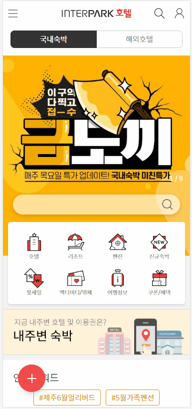

# Interpark Tour Renewel


_vue java springboot_ 이(가) 사용되었습니다.


## Overview&#x20;


모바일 접근 필요


FrontEnd 개발 리딩을 맡은 프로젝트입니다. 하이브리드 앱에 들어가는 서비스로 코어 개발을 담당했습니다. 그 외에도 App과의 통신을 위한 모든 Deeplink를 IOS, Android에 관계없이 하나의 함수로 처리되게끔 만들었으며, App의 사용자 경험을 위한 모든 애니메이션, Lazyload를 위한 스켈레톤 UI 개발, 적용하여 서비스의 완성도를 높였습니다.
